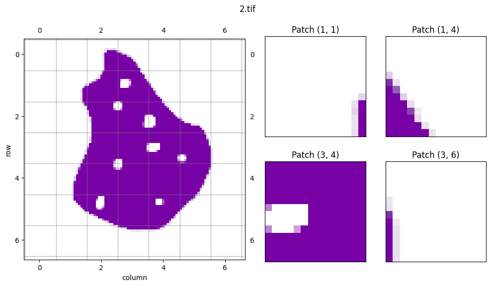

# PCAI


## Description

This repo collects code to run ML analysis on PCa images and develops the PCAI environment.

## Patch Loading

demonstrated in [patch_loader.ipynb](notebook/patch_loader.ipynb)

Simple library to load patches of a slide. Example:


## Masking
TODO

## Prepare a slide
TODO

## Build a Dataset
TODO

## Build a Data Loader
TODO

## Train a Model
TODO

## How to run

Install dependencies

```bash
# clone project
git clone https://github.com/repo
cd repo

# create conda environment
conda create -n env-pcai python=3.10 -y
conda activate env-pcai

# install libgcc for openslide
conda install -c anaconda glib
conda install -c conda-forge gcc=12.1.0

# install pytorch according to instructions
# https://pytorch.org/get-started/

# install apt requirements
xargs sudo apt-get install -y < requirements.apt


# install python requirements
pip install -r requirements.txt
```