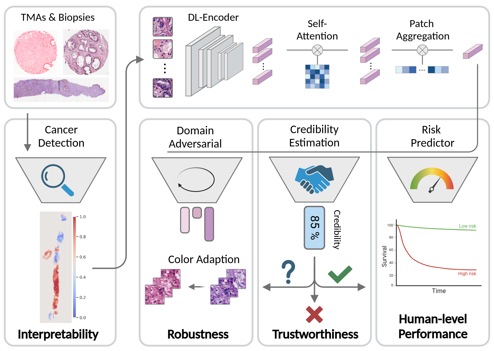
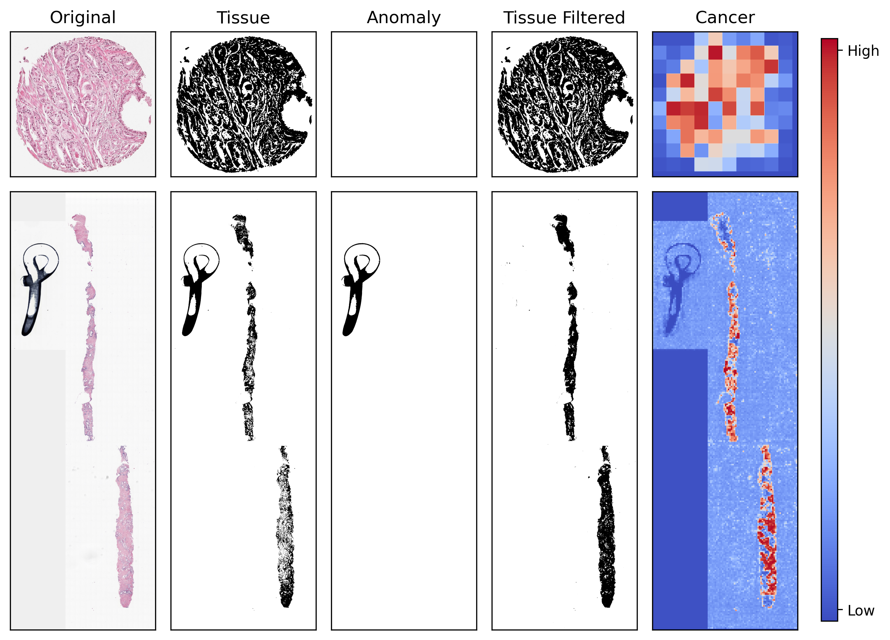
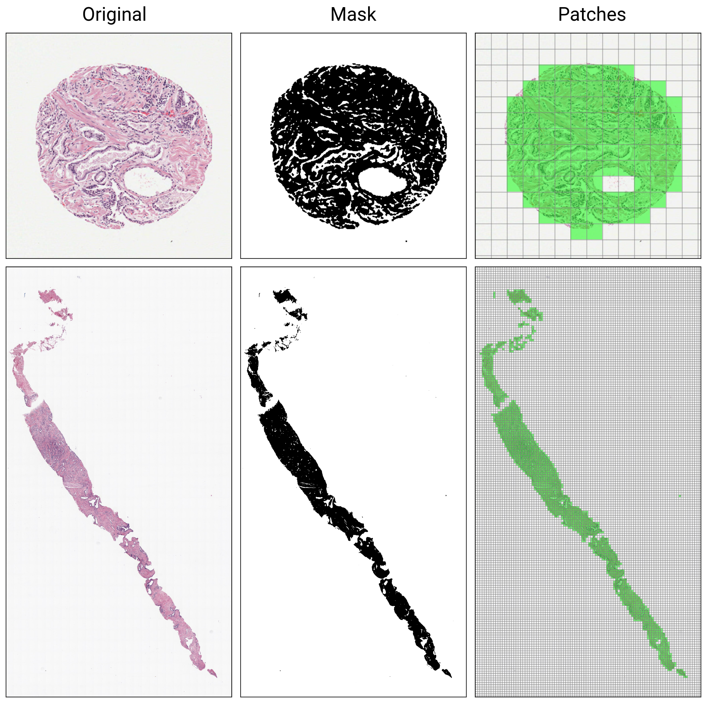
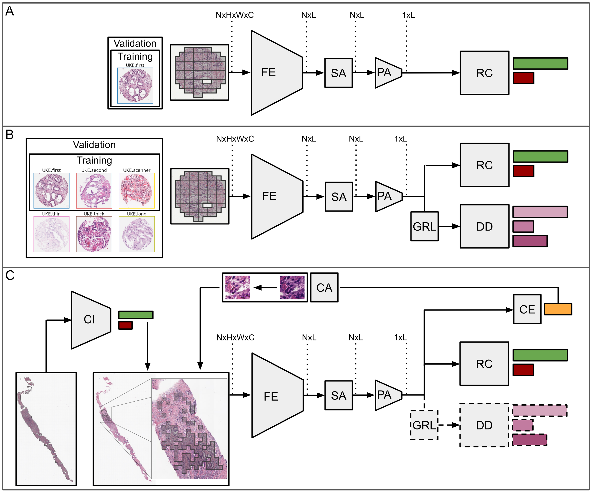
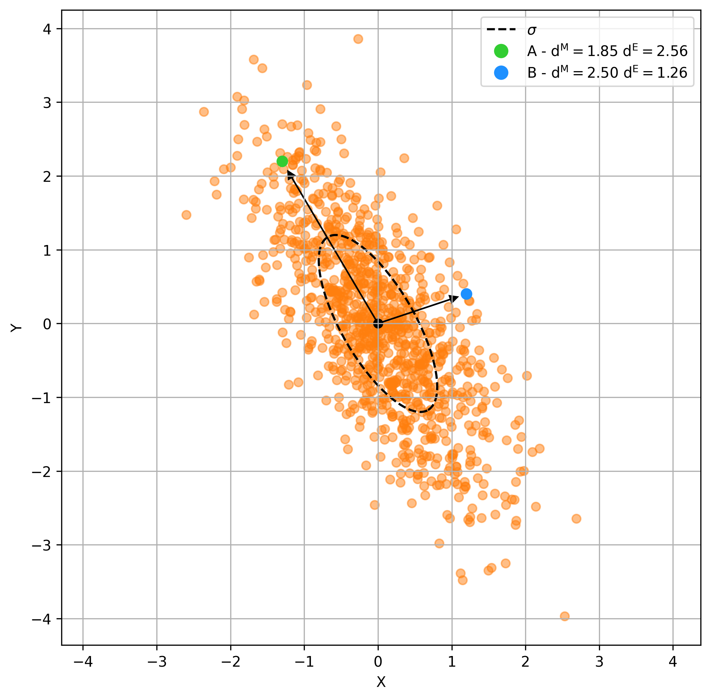
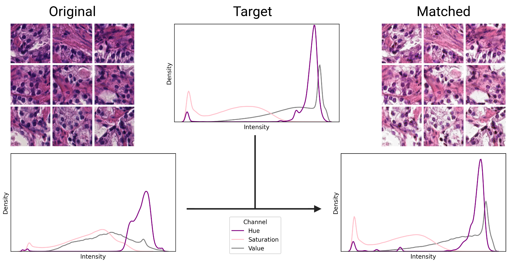
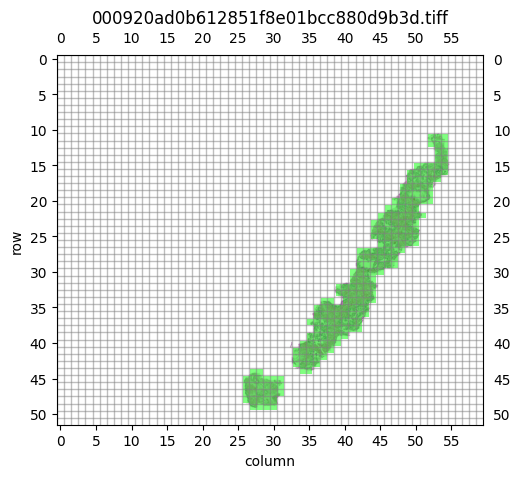
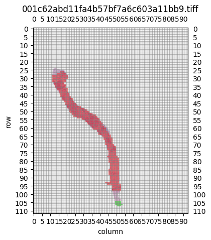
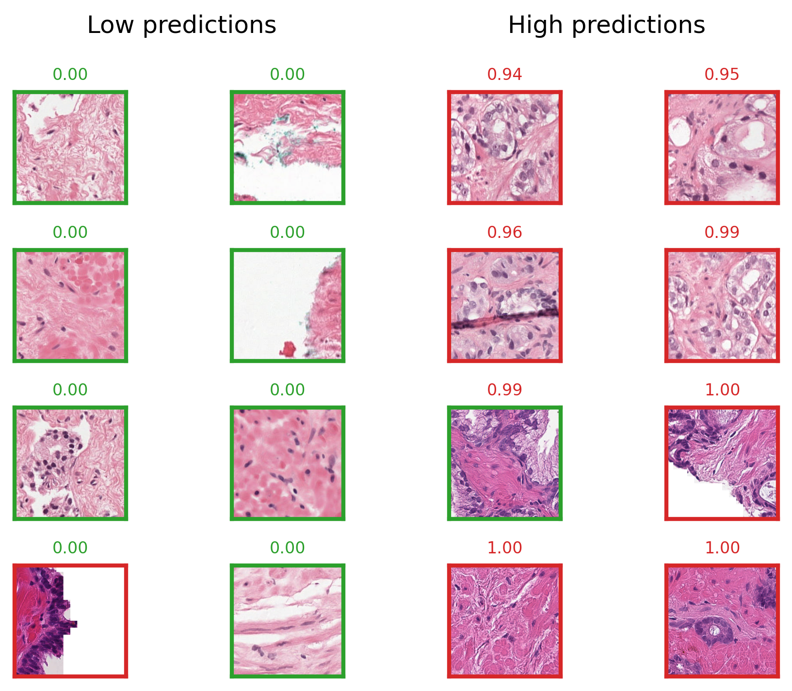

# Prostate Cancer Aggressiveness Index (PCAI)
This repository includes the main building blocks of PCAI. Since it is based on tissue microarray (TMA) spots of real patients, the original dataset is not included and replaced by a [toy dataset](data/tma_dataset/). 

<figure class="image">
    
</figure>

## How to run
The repository requires python 3.10, additional python libraries, and some system-wide packages. They can be installed (e.g. inside a docker container) using the following commands

```bash
# clone project
git clone 'this repository' pcai
cd pcai

# create conda environment
conda create -n env-pcai python=3.10 -y
conda activate env-pcai

# install libgcc for openslide
conda install -c anaconda glib
conda install -c conda-forge gcc=12.1.0

# install pytorch according to instructions
# https://pytorch.org/get-started/

# install apt requirements
xargs sudo apt-get install -y < requirements.apt

# install python requirements
pip install -r requirements.txt
```

# Sample notebooks
The following notebooks are included to provide a basic understanding of how the PCAI model works.

## PCAI
This part presents some notebooks on how to utilize the PCAI code

### 1 - Masking

<figure class="image">
    
</figure>

[01_create_masks.ipynb](notebook/01_create_masks.ipynb) demonstrates how to create tissue masks from TMA spots. The masks are used to exclude irrelevant areas from the analysis. The following example shows a toy TMA spot image and the corresponding tissue mask:

<table>
    <tr>
      <td>
        <figure class="image">
            
            <figcaption>Original spot image thumbnail.</figcaption>
        </figure>
      </td>
      <td>
        <figure class="image">
            
            <figcaption>Corresponding tissue mask.</figcaption>
        </figure>
      </td>
    </tr>
  </table>

### 2 - Prepare a slide

<figure class="image">
    
</figure>

As demonstrated in [02_patch_loader.ipynb](notebook/02_patch_loader.ipynb), the patch loaded based on [Openslide](https://openslide.org/api/python/) allows patch-wise extraction of individual patches from whole slide images. An example is shown below where four individual patches are illustrated along with an overall toy "slide":

<figure class="image">
    
</figure>

### 3  Build a Dataset

[03_patch_dataset.ipynb](notebook/03_patch_dataset.ipynb) shows how to build a pytorch dataset from the extracted patches. The dataset is used to train the PCAI model.

### 4 - Build the Architecture

<figure class="image">
    
    <figcaption>Schematic of the deep learning models. A: The BASE model, trained and validated on a single data domain (UKE.first). Images are fed as bag of patches through the CNN-based feature extractor (FE), cross-correlated in the self-attention layer (SA) and aggregated in the patch aggregation layer (PA), before the risk classification head (RC) assigns the final risk score. B: Extension for domain adversarial (DA) training on the three data domains UKE.first, UKE.second and UKE.scanner and validation on all UKEhv sub-datasets. The domain discriminator (DD) and the gradient reversal layer (GRL) are attached for dual task training. C: Schematic of the full PCAI pipline, which combines the trained DA model with cancer indicator (CI) based patch selection, credibility estimation (CE) and credibility-guided color adaptation (CA) during inference.</figcaption>
</figure>

[04_architecture.ipynb](notebook/04_architecture.ipynb) shows how to build the PCAI model architecture. The model is based on a convolutional neural network (CNN) that processes bags of patches and aggregates the information to predict a single risk score for the full bag of patches per image.

### 5 - Train a Model

[05_training.ipynb](notebook/05_training.ipynb) demonstrates how to train the PCAI model on the toy dataset and how to predict with the trained network.

### 6 - Credibility Estimation

<figure class="image">
    
</figure>

[06_credibility_estimation.ipynb](notebook/06_credibility_estimation.ipynb) shows how to estimate the credibility of the PCAI model predictions. The credibility score is based on the Mahalanobis distance of the latent feature vectors of the aggregated patches per bag to the center of training samples using a conformal prediction setup.

### 7 - Color Adaptation

<figure class="image">
    
</figure>


[07_color_adaptation.ipynb](notebook/07_color_adaptation.ipynb) demonstrates how to adapt the color of the input images that express a low credibility score to the training domain of the PCAI model. 


## Cancer Indicator model
The Cancer Indicator (CI) model can be used to preselect patches of relevant parts of biopsy slides. It is trained on the PANDA dataset to predict patch-wise labels of cancerous vs healthy tissue. The following notebooks show how the model is trained an evaluated. Note that only a few slides of the whole PANDA dataset are included in this repository. For the full dataset, see [https://panda.grand-challenge.org/](https://panda.grand-challenge.org/).

### 1 - Label Extraction

The [01_patch_extraction.ipynb](notebook/cancer_indicator/01_patch_extraction.ipynb) notebook shows how individual patches with corresponding labels (0=healthy, 1=cancerous) tissue are derived. For whole slides, the extracted patches with corresponding coordinates and a label overlay are shown:

<table>
    <tr>
      <td>
        <figure class="image">
            
            <figcaption>A biopsy that does not show cancerous tissue. Only patches that show healthy tissue are extracted (green).</figcaption>
        </figure>
      </td>
      <td>
        <figure class="image">
            
            <figcaption>A biopsy that contains a cancerous and non-cancerous area. Patches with healthy tissue (green) and patches with cancerous tissue (red) can be extracted.</figcaption>
        </figure>
      </td>
    </tr>
  </table>

### 2 - Model Training

In [02_training.ipynb](notebook/cancer_indicator/02_training.ipynb), a cancer indicator model is trained and evaluated on a few exemplary slides. The resulting model provides patch-level predictions for individual patches as shown below. Note that the results are derived from a model that only uses 24 input images for training.

<figure class="image">
    
    <figcaption>Exemplary patches with low (left) and high (right) predictions of the CI model. The originally extracted label of the patches is indicated by the red or green outline of each patch.</figcaption>
</figure>

