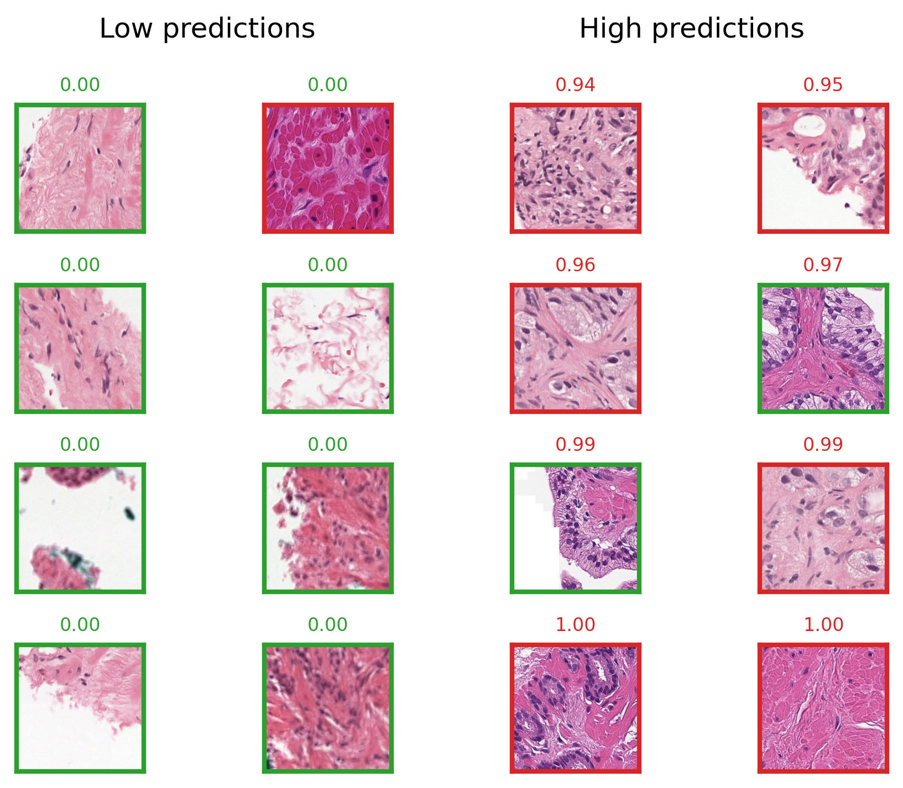

# Cancer Indicator model
The Cancer Indicator (CI) model is trained on the PANDA dataset to predict patch-wise labels of cancerous vs healthy tissue. The following notebooks show how the model is trained an evaluated. Note that only a few slides of the whole PANDA dataset are included in this repository. For the full dataset, see [https://panda.grand-challenge.org/](https://panda.grand-challenge.org/)

## Label Extraction

The [notebook/cancer_indicator/01_patch_extraction.ipynb](notebook/cancer_indicator/01_patch_extraction.ipynb) notebook shows how individual patches with corresponding labels (0=healthy, 1=cancerous) tissue are derived. For whole slides, the extracted patches with corresponding coordinates and a label overlay are shown:

<table>
    <tr>
      <td>
        <figure class="image">
            
            <figcaption>A biopsy that does not show cancerous tissue. Only patches that show healthy tissue are extracted (green).</figcaption>
        </figure>
      </td>
      <td>
        <figure class="image">
            
            <figcaption>A biopsy that contains a cancerous and non-cancerous area. Patches with healthy tissue (green) and patches with cancerous tissue (red) can be extracted.</figcaption>
        </figure>
      </td>
    </tr>
  </table>

## Model Training

In [notebook/cancer_indicator/02_training.ipynb](notebook/cancer_indicator/02_training.ipynb), a cancer indicator model is trained and evaluated on a few exemplary slides. The resulting model provides patch-level predictions for individual patches as shown below.

<figure class="image">
    
    <figcaption>Exemplary patches with low (left) and high (right) predictions of the CI model. The originally extracted label of the patches is indicated by the red or green outline of each patch.</figcaption>
</figure>

# PCAI
This part presents some notebooks on how to utilize the PCAI code

## Patch Loading

demonstrated in [patch_loader.ipynb](notebook/patch_loader.ipynb)

Simple library to load patches of a slide. Example:


## Masking
TODO

## Prepare a slide
TODO

## Build a Dataset
TODO

## Build a Data Loader
TODO

## Train a Model
TODO

# How to run

Install dependencies

```bash
# clone project
git clone https://github.com/repo
cd repo

# create conda environment
conda create -n env-pcai python=3.10 -y
conda activate env-pcai

# install libgcc for openslide
conda install -c anaconda glib
conda install -c conda-forge gcc=12.1.0

# install pytorch according to instructions
# https://pytorch.org/get-started/

# install apt requirements
xargs sudo apt-get install -y < requirements.apt


# install python requirements
pip install -r requirements.txt
```